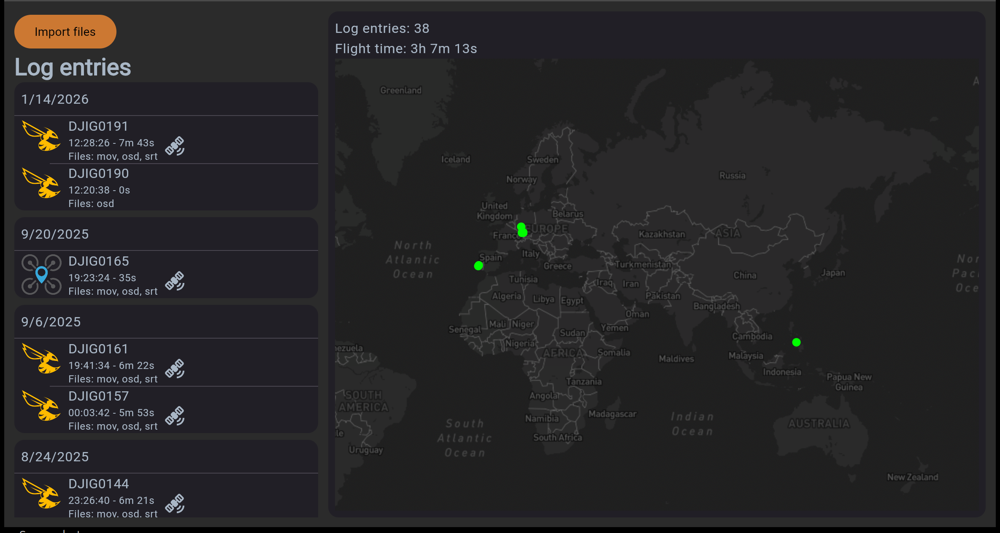
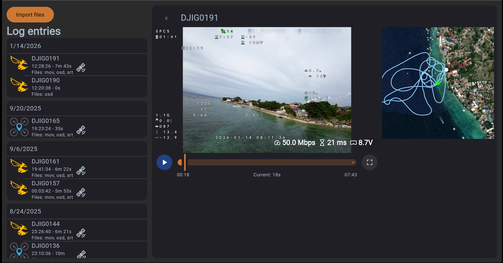
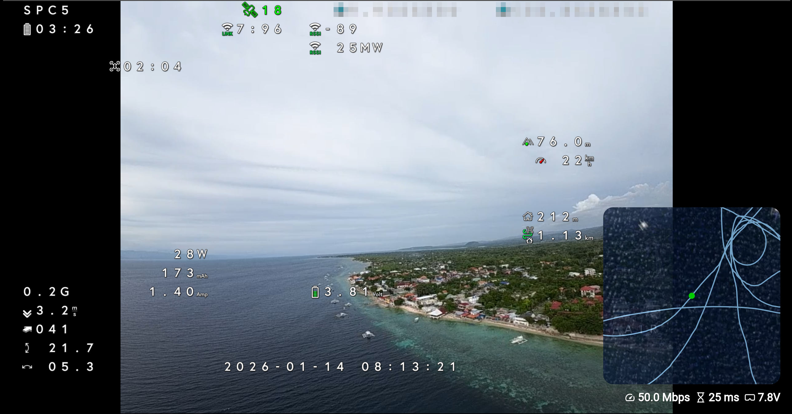

# WTF Flight Log

With this app you can open recorded video/osd files and play the video back with OSD.
It is based on the msp-osd code (https://github.com/fpv-wtf/msp-osd) and the osd-dump-tools (https://github.com/Knifa/osd-dump-tools).
Currently it is only tested with betaflight and iNav osd data.

This app is a webapp which can be used with this link:
https://timo-drick.github.io/WTF-Flight-Log/






Please note that this project is under heavy development.
Since the FPV.WTF team rooted the DJI googles the project: https://github.com/fpv-wtf/msp-osd brings the full betaflight OSD to digital video.
It is also possible to record the osd data onto the googles.
You than have 3 different files: DJIG0003.mp4, DJIG0003.srt and DJIG0003.osd
The ...osd file contains the OSD character data.
Supported devices: 
- DJI Googles V1 and V2
- Older air units Vista and original one
- O3 Air Unit
- ~~O4 Air Unit~~ not supported

## Enable osd recording
Follow the instructions on (https://github.com/fpv-wtf/msp-osd) to install msp-osd.
Than connect your google and input following in the wtfos configurator cli:
```
$ package-config set msp-osd rec_enabled true
$ package-config apply msp-osd
```
And than do some flight.

## Development

If you want to build this project yourself please follow instructions here:

[DEVELOPMENT.md](DEVELOPMENT.md)
